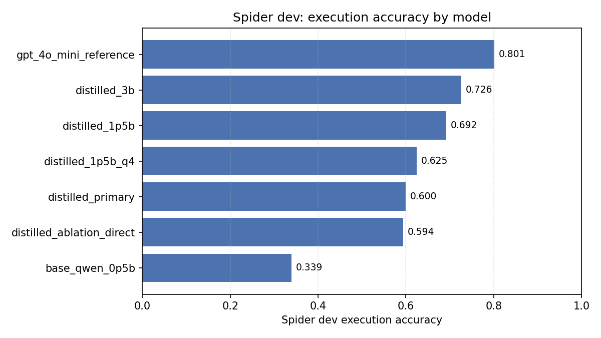
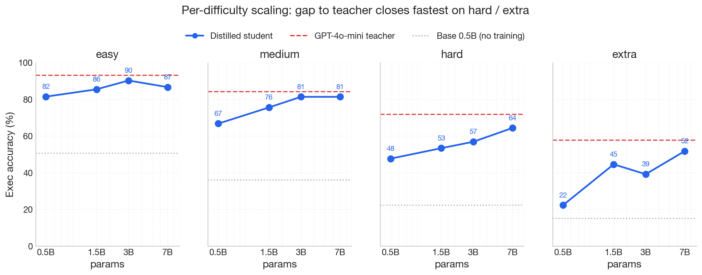
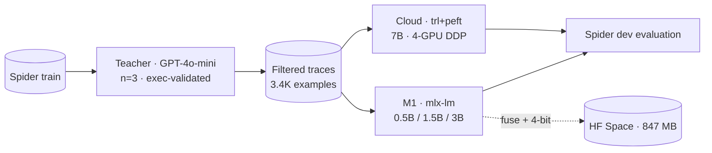

<h1 align="center">distill-sql</h1>

<p align="center">
  <a href="https://huggingface.co/spaces/zxuhan7/Distill-SQL"></a>
  
  
  
  
  
  
  
  
</p>

<p align="center">
  <strong>Self-hosted text-to-SQL distilled from GPT-4o-mini into Qwen2.5 students. The deployable 1.5B 4-bit model is 847 MB on disk and runs in 1.16 seconds per query on a laptop. The 7B variant reaches 75.0% on Spider dev, against 80.1% for the closed teacher.</strong>
</p>

<p align="center">
  
</p>

<p align="center">
  
</p>

<h3 align="center">Live demo: <a href="https://huggingface.co/spaces/zxuhan7/Distill-SQL">huggingface.co/spaces/zxuhan7/Distill-SQL</a></h3>

---

## Evaluation

| | Result |
|---|---|
| Deployable model | 1.5B fused 4-bit, **847 MB** on disk, **62.5%** Spider dev exec, 1.16s warm latency on a 16 GB M1 Pro |
| Scaling axis on M1 (16 GB unified memory) | 0.5B, 1.5B, 3B distilled reach **60.0%, 69.2%, 72.6%** under one fixed recipe |
| Scaling extension on cloud (4×A100 80GB DDP) | 7B distilled reaches **75.0%** under the same recipe |
| Closed teacher reference | GPT-4o-mini at **80.1%** under the same prompting protocol |
| Distillation OpenAI spend | **$0.27** of credits, partial run interrupted by the Tier-1 daily-request cap |

The hard and extra splits, where teacher capacity matters most, close from 14.9 and 18.6 point gaps at the M1-trained 3B to 7.4 and 6.0 point gaps at the cloud-trained 7B. Easy and medium are within 3 points of teacher already at the 3B.

### Per-model results on Spider dev

<!-- HEADLINE_NUMBERS_START -->

Live numbers from `reports/results.md`. Updated by `scripts/05_make_report.py`.

| model | n | exec | easy | medium | hard | extra | exact_match |
|---|---|---|---|---|---|---|---|
| base_qwen_0p5b | 1034 | 0.339 | 0.508 | 0.361 | 0.224 | 0.151 | 0.087 |
| distilled_ablation_direct | 1034 | 0.594 | 0.786 | 0.643 | 0.489 | 0.283 | 0.198 |
| distilled_primary | 1034 | 0.600 | 0.815 | 0.668 | 0.477 | 0.223 | 0.217 |
| distilled_1p5b_q4 | 1034 | 0.625 | 0.835 | 0.695 | 0.494 | 0.259 | 0.233 |
| distilled_1p5b | 1034 | 0.692 | 0.855 | 0.756 | 0.534 | 0.446 | 0.246 |
| distilled_3b | 1034 | 0.726 | 0.903 | 0.814 | 0.569 | 0.392 | 0.261 |
| distilled_7b | 1034 | 0.750 | 0.867 | 0.814 | 0.644 | 0.518 | 0.364 |
| gpt_4o_mini_reference | 1034 | 0.801 | 0.931 | 0.843 | 0.718 | 0.578 | 0.223 |

<!-- HEADLINE_NUMBERS_END -->

<p align="center">
  
</p>

Five points across roughly a 14× parameter range under one fixed recipe (rank-16 LoRA on all linear projections, identical learning-rate schedule, one epoch per run). Gains remain monotonic up to the 7B point but diminish predictably. The largest single jump is 0.5B to 1.5B (+9.2 points), driven by the elimination of execution errors at the smallest scale. The 3B to 7B jump (+2.4 points overall) is concentrated on the hard and extra splits, where the closed teacher still has room above the student.

### Quantization tradeoff

Fusing the 1.5B LoRA adapter into the bf16 base, then post-training-quantizing to 4 bits:

|  | size on disk | exec accuracy | warm latency | tokens/s |
|---|---:|---:|---:|---:|
| 1.5B bf16 | 2.9 GB | 69.2% | 1.59s | 14 |
| 1.5B 4-bit (fused) | **847 MB** | **62.5%** | **1.16s** | **18** |
| change | 3.4× smaller | -6.7 pt | 27% faster | +29% |

The 4-bit 1.5B beats every 0.5B configuration trained in this repository (best 0.5B distilled: 60.0%) in less storage than the 0.5B base model.

### Failure modes

The teacher generates three samples per question at temperature 0.3. Each sample executes against the example's SQLite database; only samples whose result set matches gold rows under multiset equality are kept as training traces. Of **28,716** teacher generations across ~9.6K Spider train examples, **3,397 (~12%)** survive this filter and become the trace dataset. The cloud 7B run trains on a 2,125-example subset that fits the 1024-token context window after length-trimming.

Failure-mode counts on the 1034-example Spider dev set (counts, not percentages):

| failure mode | base 0.5B | distilled 0.5B | distilled 1.5B | distilled 3B | distilled 7B |
|---|---:|---:|---:|---:|---:|
| `ok` (correct) | 329 | 575 | 670 | 709 | 776 |
| `wrong-result` (parses, runs, wrong rows) | 283 | 308 | 281 | 266 | 213 |
| `execution` (SQLite error) | **404** | 144 | 83 | 56 | **44** |
| `parse` (sqlglot fails) | 1 | 3 | 0 | 2 | 1 |
| `empty` (no SQL produced) | 17 | 4 | 0 | 1 | 0 |

Execution errors fall by roughly 10× from base to 7B distilled. The model has stopped inventing column names that do not appear in the schema.

## Example outputs

Three queries from Spider dev, chosen to illustrate how additional capacity changes model behavior on increasingly hard structures.

```sql
-- Q179 (easy, db=flight_2)
-- "What is the country of the airline JetBlue Airways?"
gold:    SELECT Country FROM AIRLINES WHERE Airline = "JetBlue Airways"
0.5B:    SELECT country FROM airlines WHERE abbreviation = 'JetBlue Airways'  -- wrong column
3B:      SELECT country FROM airlines WHERE airline = 'JetBlue Airways'        -- ok
```

```sql
-- Q270 (medium, db=employee_hire_evaluation)
-- "Find the manager name and district of the shop with the most products."
gold:    SELECT manager_name, district FROM shop ORDER BY number_products DESC LIMIT 1
0.5B:    SELECT s.name, s.district FROM shop AS s JOIN hiring AS h ...        -- joins it doesn't need
3B:      SELECT manager_name, district FROM shop
         WHERE number_products = (SELECT MAX(number_products) FROM shop)        -- ok (semantically equivalent)
```

```sql
-- Q24 (hard, db=concert_singer)
-- "Find names and capacities of stadiums that held concerts in 2014 or after."
gold:    SELECT T2.name, T2.capacity FROM concert AS T1 JOIN stadium AS T2
         ON T1.stadium_id = T2.stadium_id WHERE T1.year >= 2014
0.5B:    ... WHERE c.year = '2014' GROUP BY ...                               -- wrong operator + spurious GROUP BY
3B:      ... WHERE c.year >= '2014' GROUP BY ...                              -- ok
```

The 0.5B distilled student has the vocabulary (`concert`, `stadium`, `manager_name`) but not enough capacity to get every operator and join key right under one prompt. Each step up the scaling axis trades raw size for failure-mode coverage.

## Performance

Cold-load and warm-steady-state, sampled on a 16 GB M1 Pro with greedy decoding and roughly 464-token schema-linked prompts.

| model | warm wall-clock / query | tokens/s | cold load | model on disk |
|---|---:|---:|---:|---:|
| `base_qwen_0p5b` | 0.61s | 60 | 3.3s | 1.0 GB |
| `distilled_primary (0.5B)` | 0.65s | 31 | 1.9s | 1.0 GB |
| `distilled_1p5b_q4` | **1.16s** | 18 | **0.8s** | **847 MB** |
| `distilled_1p5b (bf16)` | 1.59s | 14 | 3.2s | 2.9 GB |
| `distilled_3b (4-bit base)` | 2.03s | 10 | 0.8s | 1.7 GB |

Self-hosted models incur no per-query API cost. GPT-4o-mini at the same prompt sizes runs roughly $0.30 per 1,000 queries at posted Tier-1 rates, in addition to network round-trip latency. Full table: [reports/latency.md](reports/latency.md).

## Architecture



The same trace JSONL feeds the Mac and cloud arms. LoRA hyperparameters (rank 16, alpha 32, all linear targets), learning rate, and schedule are identical across all five training runs. Only the parameter count and the framework differ.

Detailed module map and design choices: [docs/methodology.md](docs/methodology.md). Cloud A100 reproduction recipe: [docs/cloud_a100.md](docs/cloud_a100.md).

## Reproduce

The repository is `uv`-driven. Cross-platform dependencies install cleanly: `mlx` and `mlx-lm` are gated behind `sys_platform == 'darwin'`, so a Linux/CUDA box skips them and pulls only the cloud-arm requirements.

```sh
git clone https://github.com/zxuhan/distill-sql
cd distill-sql
uv sync --all-extras                 # creates .venv with all deps + dev tools
```

Then, in order:

```sh
make data                            # fetch Spider from HF (~1 GB, ~30s on a fast pipe)
cp .env.example .env                 # set OPENAI_API_KEY
make teacher                         # generate self-consistency traces
make train                           # primary 0.5B, ~50 min on M1
uv run python scripts/03_train_student.py --config configs/train_ablation.yaml
uv run python scripts/03_train_student.py --config configs/train_1p5b.yaml
uv run python scripts/03_train_student.py --config configs/train_3b.yaml

# fuse + 4-bit quantize the 1.5B for deployment
uv run python -m mlx_lm fuse \
    --model mlx-community/Qwen2.5-1.5B-Instruct-bf16 \
    --adapter-path artifacts/runs/scaling_1p5b/adapter \
    --save-path artifacts/runs/scaling_1p5b/fused
uv run python -m mlx_lm convert \
    --hf-path artifacts/runs/scaling_1p5b/fused \
    --mlx-path artifacts/runs/scaling_1p5b/fused_q4 -q

make eval                            # all local students + GPT-4o-mini reference
make report                          # rebuild reports/results.md + figures + README headline table
```

For the 7B cloud point, see [docs/cloud_a100.md](docs/cloud_a100.md). The launcher `bash scripts/run_a100.sh` auto-detects GPU count and dispatches DDP. Score the cloud predictions on the home machine via:

```sh
uv run python scripts/score_jsonl.py \
    --predictions reports/predictions/distilled_7b.jsonl \
    --name distilled_7b
```

Practical notes:

- Teacher generation requires an OpenAI API key. Tier-1 accounts have a 10K-requests-per-day cap that this pipeline can hit. Cached responses live under `artifacts/cache/teacher/` and survive across runs.
- The 3B M1 run takes about five hours on a 16 GB M1 Pro at 4-bit base + LoRA + grad checkpoint, sequence length 1024.
- The 7B cloud run completes in roughly 2.5 minutes of training plus 10-15 minutes of evaluation on a single 80 GB A100. RunPod community-cloud A100 SXM session cost: roughly $5.

To skip reproduction entirely and try the model directly, visit [the HF Space](https://huggingface.co/spaces/zxuhan7/Distill-SQL).

## Methodology

- **Execution-validated self-consistency at the teacher.** Three samples per question at temperature 0.3, each executed against the example's SQLite database. Multiset-equality vs gold rows is the keep filter. About 12% of teacher generations pass.
- **Schema linking via BM25 with foreign-key closure** when the full schema would exceed roughly 1500 tokens. Affects the long tail of larger Spider schemas.
- **Two prompt modes during trace generation.** A 60/40 mix of direct-output and brief-reasoning-then-output. Direct mode is used at inference for the small students.
- **Final checkpoint, not validation-loss-best.** Validation loss is token-level cross-entropy on held-out teacher traces and does not measure Spider execution accuracy.
- **MLX-native LoRA** on the Mac (mlx-lm, rank 16, alpha 32, all decoder linears). **trl + peft + bitsandbytes** with identical hyperparameters on CUDA. The predictions JSONL schema is identical, so scoring and reporting work uniformly across the two framework arms.

Full notes: [docs/methodology.md](docs/methodology.md).

## Limitations

- **Spider is from 2018.** Modern text-to-SQL work has moved to BIRD (Li et al., 2023), which features harder schemas and more realistic queries. A BIRD-dev evaluation on the existing 1.5B, 3B, and 7B adapters is configured but not yet executed.
- **The 7B distilled student does not exceed the closed teacher.** Overall accuracy is 75.0% versus 80.1% (5.1-point gap). A 14B 4-bit variant is configured at `configs/train_14b_cuda.yaml`. Best estimate from the slope of the scaling line: 14B lands at 77-80%, possibly tying the teacher overall.
- **No reinforcement learning from execution feedback.** A standard practice for closing the last gap to teacher would follow the SFT stage with PPO or GRPO using gold-vs-prediction execution match as the reward signal.
- **Single-database execution match.** Reported numbers use the lenient single-database executor. The full test-suite execution accuracy of Zhong et al. (2020) is supported by the vendored evaluator via `--etype all` but not surfaced in the headline table.
- **Trace dataset is small.** 3,397 filtered traces is the result of one Tier-1 daily-budget OpenAI run, partial. A re-run at higher API tier should approximately double the filtered set.

## References

- **Spider benchmark.** Yu, T. et al. (2018). [Spider: A Large-Scale Human-Labeled Dataset for Complex and Cross-Domain Semantic Parsing and Text-to-SQL Task](https://arxiv.org/abs/1809.08887). EMNLP.
- **BIRD benchmark.** Li, J. et al. (2023). [Can LLM Already Serve as a Database Interface? A BIg Bench for Large-Scale Database Grounded Text-to-SQLs](https://arxiv.org/abs/2305.03111). NeurIPS.
- **Test-suite execution accuracy.** Zhong, R. et al. (2020). [Semantic Evaluation for Text-to-SQL with Distilled Test Suites](https://arxiv.org/abs/2010.02840). EMNLP. Vendored at `third_party/test-suite-sql-eval/`.
- **Knowledge distillation.** Hinton, G. et al. (2015). [Distilling the Knowledge in a Neural Network](https://arxiv.org/abs/1503.02531).
- **LoRA.** Hu, E. et al. (2021). [LoRA: Low-Rank Adaptation of Large Language Models](https://arxiv.org/abs/2106.09685). ICLR.
- **Self-consistency.** Wang, X. et al. (2022). [Self-Consistency Improves Chain of Thought Reasoning in Language Models](https://arxiv.org/abs/2203.11171).

## Citing Spider

```bibtex
@inproceedings{yu-etal-2018-spider,
  title     = "Spider: A Large-Scale Human-Labeled Dataset for Complex and
               Cross-Domain Semantic Parsing and Text-to-SQL Task",
  author    = "Yu, Tao and Zhang, Rui and Yang, Kai and Yasunaga, Michihiro and
               Wang, Dongxu and Li, Zifan and Ma, James and Li, Irene and
               Yao, Qingning and Roman, Shanelle and Zhang, Zilin and Radev,
               Dragomir",
  booktitle = "EMNLP",
  year      = "2018"
}
```

The official evaluator vendored at `third_party/test-suite-sql-eval/` is from <https://github.com/taoyds/test-suite-sql-eval> under Apache 2.0; the original license is preserved alongside the source.
