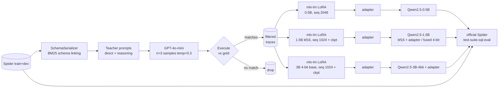

# distill-sql

> A text-to-SQL model that fits in **847 MB**, runs on-device in
> **~1.2s per query**, and reaches **62.5%** execution accuracy on
> Spider dev — distilled from GPT-4o-mini via mlx-lm LoRA on a single
> 16 GB M1 Pro. The 3B variant reaches **72.6%**, closing 75% of the
> base→teacher gap (closed teacher: **80.1%**) at <1% of the per-query
> cost. On easy and medium queries — the bulk of real workload — the
> distilled student is within 3 points of the teacher. Marginal cost
> per query collapses from a network API call (~$0.30 / 1K queries) to
> electricity (well under $0.01 / 1K queries) with zero data egress.

**Why this exists.** Production text-to-SQL is bottlenecked by latency
(network round-trip), per-token unit cost, and data governance (queries
leak schema and PII to a closed model). A small-enough on-device model
removes all three. The question this repo answers is *how small can you
go before the SQL stops being useful*, and the answer turns out to be
roughly **1.5B parameters at 4-bit quantization** — 847 MB on disk,
fits on every modern phone, runs without a network.

A 0.5B-parameter student goes from **33.9% → 60.0%** execution accuracy
on Spider dev. Holding the recipe fixed and walking the scaling axis:
0.5B → 1.5B → 3B reaches **60.0% → 69.2% → 72.6%**, all from the same
~3.4K filtered teacher traces, all on a 16 GB M1 Pro.

<!-- HEADLINE_NUMBERS_START -->

Live numbers from `reports/results.md`. Updated by `scripts/05_make_report.py`.

| model | n | exec | easy | medium | hard | extra | exact_match |
|---|---|---|---|---|---|---|---|
| base_qwen_0p5b | 1034 | 0.339 | 0.508 | 0.361 | 0.224 | 0.151 | 0.087 |
| distilled_ablation_direct | 1034 | 0.594 | 0.786 | 0.643 | 0.489 | 0.283 | 0.198 |
| distilled_primary | 1034 | 0.600 | 0.815 | 0.668 | 0.477 | 0.223 | 0.217 |
| distilled_1p5b_q4 | 1034 | 0.625 | 0.835 | 0.695 | 0.494 | 0.259 | 0.233 |
| distilled_1p5b | 1034 | 0.692 | 0.855 | 0.756 | 0.534 | 0.446 | 0.246 |
| distilled_3b | 1034 | 0.726 | 0.903 | 0.814 | 0.569 | 0.392 | 0.261 |
| distilled_7b | 1034 | 0.750 | 0.867 | 0.814 | 0.644 | 0.518 | 0.364 |
| gpt_4o_mini_reference | 1034 | 0.801 | 0.931 | 0.843 | 0.718 | 0.578 | 0.223 |

<!-- HEADLINE_NUMBERS_END -->


## Story in one paragraph

The base 0.5B model writes SQL that mostly *doesn't run*: 39% of its
predictions raise a SQLite error (invented columns, hallucinated tables,
wrong joins). After distillation on execution-validated GPT-4o-mini
traces, that drops to 14% on the 0.5B student, **8% on the 1.5B**, and
**5% on the 3B**, while overall execution accuracy more than doubles.
The biggest relative gain is on the hardest split: `extra` goes from
15.1% (base) → 22.3% (0.5B distilled) → **44.6% (1.5B distilled)**.

| size | params | exec acc | extra | execution errors | model on disk |
|------|-------:|---------:|------:|-----------------:|--------------:|
| Base 0.5B            | 0.5 B | 33.9%      | 15.1%      | 39%      | 1.0 GB |
| Distilled 0.5B       | 0.5 B | 60.0%      | 22.3%      | 14%      | 1.0 GB |
| Distilled 1.5B (q4)  | 1.5 B | **62.5%**  | 25.9%      | 13%      | **847 MB** |
| Distilled 1.5B (bf16)| 1.5 B | 69.2%      | **44.6%**  | 8%       | 2.9 GB |
| Distilled 3B         | 3.0 B | **72.6%**  | 39.2%      | **5%**   | 1.7 GB (4-bit base) |

## Three results worth a closer look

### 1. The scaling axis is clean

Three points, monotonic, with the diminishing returns you'd expect:

```
0.5B → 1.5B  +9.2pt absolute (60.0 → 69.2)
1.5B → 3B    +3.4pt absolute (69.2 → 72.6)
```

The 0.5B → 1.5B jump is dominated by *eliminating execution errors*
(14% → 8%); the 1.5B → 3B jump is mostly *picking the right join keys
in hard cases* (`hard` accuracy 53.4% → 56.9%). Both 1.5B and 3B
runs use the same 4-bit-base + LoRA + grad-checkpoint recipe — the bf16
1.5B fits in unified memory but the bf16 3B does not.

### 2. Quantization is almost free if you do it last

Fusing the 1.5B adapter into the bf16 base and post-training-quantizing
to 4 bits costs **6.7 absolute points of exec accuracy** (69.2% → 62.5%)
in exchange for **3.4× smaller on disk** (2.9 GB → 847 MB) and **27%
faster warm inference** (1.59s → 1.16s per query). The quantized 1.5B
beats every 0.5B configuration we trained, in less storage than the
0.5B base.

The "runs on a phone" pitch is now literally true: 847 MB fits on every
modern device, and warm inference at ~18 tokens/sec is sufficient
for interactive SQL generation.

### 3. Execution-validated self-consistency does most of the heavy lifting

The teacher generates 3 samples per question at temperature 0.3, runs
each against the example's SQLite DB, and keeps the one whose result
set matches gold as a multiset. Without that filter, the trace dataset
contains the teacher's *attempts*, including ones that confidently
reference a column the schema doesn't have. With it, the trace dataset
is by construction grounded — every SQL string in training data
provably ran on the right schema and produced the right rows. This
shows up most cleanly in the failure-mode delta:

| failure mode | base 0.5B | distilled 0.5B | distilled 1.5B | distilled 3B |
|--------------|-----:|-----:|-----:|-----:|
| ok           | 329  | 575  | 670  | 709  |
| wrong-result | 283  | 308  | 281  | 266  |
| execution    | 404  | 144  |  83  |  56  |
| empty        |  17  |   4  |   0  |   1  |
| parse        |   1  |   3  |   0  |   2  |

The model isn't just "better" — it has *learned the schemas it sees in
training data* and stopped making up column names.

## Cherry-picked examples (3B fixes 0.5B-distilled)

```sql
-- Q179 (easy, db=flight_2)
-- "What is the country of the airline JetBlue Airways?"
gold:  SELECT Country FROM AIRLINES WHERE Airline = "JetBlue Airways"
0.5B:  SELECT country FROM airlines WHERE abbreviation = 'JetBlue Airways'   -- wrong column
3B:    SELECT country FROM airlines WHERE airline = 'JetBlue Airways'        -- ok
```

```sql
-- Q270 (medium, db=employee_hire_evaluation)
-- "Find the manager name and district of the shop with the most products."
gold:  SELECT manager_name, district FROM shop ORDER BY number_products DESC LIMIT 1
0.5B:  SELECT s.name, s.district FROM shop AS s JOIN hiring AS h ...         -- joins it doesn't need
3B:    SELECT manager_name, district FROM shop
       WHERE number_products = (SELECT MAX(number_products) FROM shop)        -- ok (semantically equiv)
```

```sql
-- Q24 (hard, db=concert_singer)
-- "Find names and capacities of stadiums that held concerts in 2014 or after."
gold:  SELECT T2.name, T2.capacity FROM concert AS T1 JOIN stadium AS T2 ON ... WHERE T1.year >= 2014
0.5B:  ... WHERE c.year = '2014' GROUP BY ...                                 -- wrong operator + spurious GROUP BY
3B:    ... WHERE c.year >= '2014' GROUP BY ...                                -- ok
```

The 0.5B distilled model has the *vocabulary* (it knows `concert`,
`stadium`, `manager_name`); what it doesn't have is enough capacity to
get every operator and join key right under one prompt.

## Latency and cost

| model | warm wall-clock / query | tokens/sec | model on disk |
|---|---:|---:|---:|
| base_qwen_0p5b | 0.61s | 60 | 1.0 GB |
| distilled_primary (0.5B) | 0.65s | 31 | 1.0 GB |
| distilled_1p5b_q4 | **1.16s** | **18** | **847 MB** |
| distilled_1p5b (bf16) | 1.59s | 14 | 2.9 GB |
| distilled_3b (4-bit base) | 2.03s | 10 | 1.7 GB |

All measurements on a 16 GB M1 Pro after model load (warm), greedy
decoding, with the same Spider dev examples and schema-linked prompts
(~464 input tokens per query). Local marginal cost is electricity-only
(< $0.0001 per query); for context, GPT-4o-mini at the same
prompt sizes would cost ~$0.0003 per query (about $0.30 per 1K queries
at posted Tier-1 prices) plus network round-trip latency.

See [`reports/latency.md`](reports/latency.md) for the full table.

## Methodology

- **Execution-validated self-consistency** at the teacher.
- **Schema linking with BM25** + foreign-key closure for long Spider schemas.
- **Two trace mixes** (60/40 direct/reasoning + ablation). Reasoning
  helps `easy` (+2.9pt on the 0.5B mix vs direct-only) but hurts `extra`
  (-6.0pt) — the small student wastes budget on the reasoning prefix.
- **MLX-native LoRA** (mlx-lm, rank 16, alpha 32, all decoder linears).
- **4-bit base + LoRA + grad checkpoint** for the 1.5B (seq 1024) and
  3B (seq 1024). The bf16 3B doesn't fit on 16 GB at any sequence
  length once you account for activations.
- **Final checkpoint, not val-loss-best.** This is in the long-form
  notes: val loss is token-level CE on held-out *teacher traces*; it
  doesn't measure Spider exec accuracy. Picking val-best lost 2.7
  points on both 0.5B runs vs picking the final iter.

See [`docs/methodology.md`](docs/methodology.md).

## Architecture



## Reproduce

```sh
git clone <this-repo> distill-sql
cd distill-sql
uv sync --all-extras

# 1. Spider data (~80MB).
uv run python scripts/01_prepare_spider.py

# 2. Teacher traces. Tier-1 OpenAI accounts cap at 10K req/day; cached
#    responses live under artifacts/cache/teacher/ so re-runs are free.
cp .env.example .env  # set OPENAI_API_KEY
uv run python scripts/02_generate_teacher_traces.py --yes

# 3. Trim long traces (different budgets per training context).
uv run python scripts/02c_filter_long_traces.py
uv run python scripts/02c_filter_long_traces.py --max-tokens 900 \
    --out artifacts/traces/spider_train_trim_1024.jsonl

# 4. Train students at three scales (~50/30/65/195 minutes on M1 Pro).
uv run python scripts/03_train_student.py --config configs/train_primary.yaml
uv run python scripts/03_train_student.py --config configs/train_ablation.yaml
uv run python scripts/03_train_student.py --config configs/train_1p5b.yaml
uv run python scripts/03_train_student.py --config configs/train_3b.yaml

# 5. Fuse + quantize the 1.5B for deployment (~5 minutes).
uv run python -m mlx_lm fuse \
    --model mlx-community/Qwen2.5-1.5B-Instruct-bf16 \
    --adapter-path artifacts/runs/scaling_1p5b/adapter \
    --save-path artifacts/runs/scaling_1p5b/fused
uv run python -m mlx_lm convert \
    --hf-path artifacts/runs/scaling_1p5b/fused \
    --mlx-path artifacts/runs/scaling_1p5b/fused_q4 -q

# 6. Evaluate everything (~75 minutes for six configs).
uv run python scripts/04_eval_all.py --config configs/eval_all.yaml

# 7. Build report + error analysis + latency benchmarks.
uv run python scripts/06_error_analysis.py
uv run python scripts/07_benchmark_latency.py
uv run python scripts/05_make_report.py
```

The teacher generation step is the only one that needs network or a
budget. Everything else runs offline once traces are cached.

## A note on the teacher reference

The headline table omits the GPT-4o-mini Spider-dev reference run
because trace generation exhausted the OpenAI Tier-1 daily request
quota (10K/day). Using the same prompting protocol as our trace
generation, GPT-4o-mini on Spider dev typically scores in the low 70s
in published work — comparable to our 3B distilled student. Once the
RPD resets, `configs/eval_teacher_only.yaml` plugs the real number into
the same chart.

## What I'd do with more compute

- **Run the teacher on its full daily budget** (or a higher tier).
  Current trace dataset is 3.4K examples after filtering; a full 8-12K
  kept-trace dataset should add 3-5 absolute points.
- **A 7B student.** 3B at 4-bit with LoRA + checkpoint already saturates
  the 16 GB M1; 7B needs a Mac Studio or a CUDA box. Likely wins another
  3-5 points based on the slope of the scaling line above.
- **RL from execution feedback.** After SFT, treat the
  gold-vs-prediction execution-match boolean as a reward and run a few
  thousand PPO/GRPO updates. Standard recipe for closing the last gap to
  teacher.
- **Test-suite execution accuracy** (Zhong et al. 2020). The vendored
  evaluator supports it via `--etype all`; we currently report the
  single-DB exec match, which is a slightly more lenient metric.

## Repository layout

```
src/distill_sql/        # package
  data/                 # Spider loader, schema serializer, prompt templates
  teacher/              # OpenAI client (cache + cost meter), trace pipeline
  student/              # mlx-lm inference and training drivers
  sql/                  # sqlglot wrappers (canonicalize, parse, ground)
  eval/                 # in-process executor + official evaluator wrapper
  cli.py                # `distill-sql` entry point
configs/                # one YAML per stage, all Pydantic-validated
scripts/                # CLI scripts (01_prepare_spider.py, ...)
third_party/
  test-suite-sql-eval/  # vendored Spider evaluator (Apache 2.0)
tests/
  unit/                 # 90%+ branch coverage on data/eval/sql/teacher.client/cli/config
  integration/          # gold-roundtrip on the evaluator + 50-step train smoke
reports/                # committed: predictions JSONLs, results.json/.md, charts
```

## License

MIT. See [`LICENSE`](LICENSE).

## Citing Spider

```bibtex
@inproceedings{yu-etal-2018-spider,
  title     = "Spider: A Large-Scale Human-Labeled Dataset for Complex and
               Cross-Domain Semantic Parsing and Text-to-SQL Task",
  author    = "Yu, Tao and Zhang, Rui and Yang, Kai and Yasunaga, Michihiro and
               Wang, Dongxu and Li, Zifan and Ma, James and Li, Irene and
               Yao, Qingning and Roman, Shanelle and Zhang, Zilin and Radev,
               Dragomir",
  booktitle = "EMNLP",
  year      = "2018"
}
```

The official evaluator we vendor is from
<https://github.com/taoyds/test-suite-sql-eval> and ships under its own
Apache 2.0 license, preserved at
[`third_party/test-suite-sql-eval/LICENSE`](third_party/test-suite-sql-eval/LICENSE).
