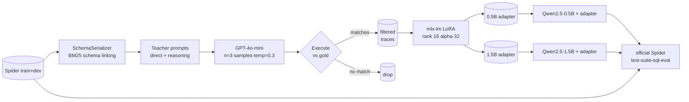

# distill-sql

> Task-specific distillation of GPT-4o-mini text-to-SQL into Qwen2.5
> students (0.5B and 1.5B), trained locally on a 16 GB M1 Pro via mlx-lm
> LoRA, evaluated on the Spider benchmark with the official
> `test-suite-sql-eval` evaluator.

A 0.5B-parameter student goes from **33.9% → 60.0%** execution accuracy on
Spider dev. Holding the recipe fixed and scaling the student to 1.5B reaches
**69.2%**, approaching the literature-reported GPT-4o-mini range
(low 70s) — produced from the same ~3.4K filtered teacher traces, on
the same hardware.

<!-- HEADLINE_NUMBERS_START -->

Live numbers from `reports/results.md`. Updated by `scripts/05_make_report.py`.

| model | n | exec | easy | medium | hard | extra | exact_match |
|---|---|---|---|---|---|---|---|
| base_qwen_0p5b | 1034 | 0.339 | 0.508 | 0.361 | 0.224 | 0.151 | 0.087 |
| distilled_ablation_direct | 1034 | 0.594 | 0.786 | 0.643 | 0.489 | 0.283 | 0.198 |
| distilled_primary | 1034 | 0.600 | 0.815 | 0.668 | 0.477 | 0.223 | 0.217 |
| distilled_1p5b | 1034 | 0.692 | 0.855 | 0.756 | 0.534 | 0.446 | 0.246 |

<!-- HEADLINE_NUMBERS_END -->


## Story in one paragraph

The base 0.5B model writes SQL that mostly *doesn't run*: 39% of its
predictions raise a SQLite error (invented columns, hallucinated tables,
wrong joins). After distillation on execution-validated GPT-4o-mini
traces, that drops to 14% on the 0.5B student and **8% on the 1.5B
student**, while overall exec accuracy roughly doubles. The biggest
relative gain is on the hardest split: `extra` goes from 15.1% (base) →
22.3% (distilled 0.5B) → **44.6% (distilled 1.5B)**.

| size | exec acc | extra | execution errors | exact_match |
|------|----------|-------|------------------|-------------|
| Base 0.5B | 33.9% | 15.1% | 39% | 8.7% |
| Distilled 0.5B | 60.0% | 22.3% | 14% | 21.7% |
| **Distilled 1.5B** | **69.2%** | **44.6%** | **8%** | **24.6%** |

## What this is

A reproducible distillation pipeline:

1. **Teacher generation.** Sample three GPT-4o-mini completions per
   Spider train example at temperature 0.3, run each against the
   example's SQLite DB, and keep the candidate whose result set
   matches gold as a multiset.
2. **Student training.** Fine-tune Qwen2.5-Instruct via LoRA on the
   filtered chat-formatted traces (mlx-lm, all decoder linears,
   rank 16). Trained at two scales: 0.5B and 1.5B.
3. **Evaluation.** Run base + three distilled adapters on Spider dev
   with the official `test-suite-sql-eval` evaluator.

## Methodology highlights

- **Execution-validated self-consistency** at the teacher. n=3 samples
  at temperature 0.3, executed against the DB, kept by gold-multiset
  match. Falls back to "anything that runs" if no match exists.
  ~76% of cached candidates execute successfully and ~70% of those
  match gold; the filter discards the rest.
- **Schema linking with BM25.** Long Spider schemas dilute attention
  on a small student. We render `CREATE TABLE` blocks with FKs and
  sample rows; if rendering would exceed ~1500 tokens, BM25 ranks
  tables against the question and drops the lowest-scoring ones, with
  a foreign-key closure pass to keep referenced tables.
- **Two training mixes for the 0.5B run.** Primary trains on a 60/40
  direct-vs-reasoning trace mix; ablation trains on direct only. The
  primary edges the ablation by 0.6 absolute points overall but the
  *direction* of the edge varies by difficulty: primary is +2.9pt on
  `easy`, but -6.0pt on `extra`. The reasoning examples mostly help
  when the student needs to plan around joins and aggregations.
- **Scaling axis: 0.5B → 1.5B.** Same recipe, same trace dataset, same
  rank/alpha. The 1.5B student adds 9.2 absolute points overall and
  +22.3 points on `extra`. Memory-tight on 16 GB so the 1.5B run
  uses seq 1024 with gradient checkpointing.
- **MLX-native training.** No CUDA detour. ~1 it/sec at batch 1, grad
  accum 8, seq 2048 on M1 Pro for the 0.5B; ~0.5 it/sec at seq 1024
  with grad checkpointing for the 1.5B. Peak memory: 11.4 GB (0.5B),
  5.2 GB (1.5B with checkpointing).

See [`docs/methodology.md`](docs/methodology.md) for the long-form
discussion. The full per-category error analysis with example pairs is
in [`reports/error_analysis.md`](reports/error_analysis.md).

## A negative result worth keeping

I tried picking the val-loss-best checkpoint instead of the final one
(common practice in language-model SFT). On both 0.5B runs, the
val-best adapter (val_loss 0.247) scored **2.7 points lower** on
Spider exec accuracy than the final adapter (val_loss 0.331). The
teacher-imitation loss isn't measuring what Spider exec accuracy
measures — it's a token-level CE on a held-out trace slice that
rewards getting "ORDER BY age LIMIT 1" right at every step but
penalizes the harmless `count(*)` vs `COUNT(*)` style flip the same
way. Final-checkpoint selection wins. The discarded experiment lives
in `artifacts/runs/{primary,ablation_direct_only}/adapter/adapters_final_*.safetensors`.

## Architecture



## Error analysis

The biggest single failure-mode shift between the base and the distilled
1.5B is **execution errors collapsing**:

| failure mode | base | dist 0.5B primary | dist 1.5B |
|--------------|-----:|-----:|-----:|
| ok           | 329  | 575  | 670  |
| wrong-result | 283  | 308  | 281  |
| execution    | 404  | 144  |  83  |
| empty        |  17  |   4  |   0  |
| parse        |   1  |   3  |   0  |

`execution` is the bucket where the model's SQL parses but raises a
`sqlite3.Error` — almost always a column or table name that doesn't
exist. Distillation alone (0.5B → 0.5B+adapter) cuts these from 39%
to 14%; scaling to 1.5B cuts them further to 8%. The model has
learned the actual schemas it sees in training and stops inventing
columns.

`scripts/06_error_analysis.py` runs `find_disagreements` programmatically
between any base/treatment pair and writes per-category counts to
`reports/error_analysis.md`. Cleaning the cases where the 1.5B fixes
something the base broke produces 389 unique wins, 48 unique
regressions, **net +341**. Top win categories:

| category | n |
|---|---|
| schema-mismatch (base hallucinated a column/table) | 187 |
| missing-filter (base missed a WHERE) | 27 |
| missing-join | 27 |
| aggregation-mismatch (e.g., `count(*)` vs `*`) | 11 |

A representative `schema-mismatch` shift:

```sql
-- Q: What are the names and release years for all the songs of the youngest singer?
-- gold:    SELECT song_name, song_release_year FROM singer ORDER BY age LIMIT 1
-- base:    SELECT s.Singer_Name, s.Song_release_year FROM singer s JOIN ...     -- execution (no Singer_Name)
-- 0.5B:    SELECT Song_Name, Song_release_year FROM singer ORDER BY Age LIMIT 1 -- ok
-- 1.5B:    SELECT song_name, song_release_year FROM singer ORDER BY age LIMIT 1 -- ok (and casing matches gold)
```

## Reproduce

Clone, install, run.

```sh
git clone <this-repo> distill-sql
cd distill-sql
uv sync --all-extras

# 1. Spider data ~80MB.
uv run python scripts/01_prepare_spider.py

# 2. Teacher traces. Tier-1 OpenAI accounts cap at 10K requests/day; if you
#    hit it, the run pauses and you can resume after the daily reset, or
#    use scripts/02b_rehydrate_traces.py to build a JSONL from whatever
#    cached responses you already have.
cp .env.example .env  # then edit OPENAI_API_KEY
uv run python scripts/02_generate_teacher_traces.py --yes

# 2.5. Trim long traces (drops ~5% over 2000 tokens; avoids mlx-lm
#      truncation NaN under mask_prompt=True).
uv run python scripts/02c_filter_long_traces.py
uv run python scripts/02c_filter_long_traces.py --max-tokens 900 --out artifacts/traces/spider_train_trim_1024.jsonl

# 3. Train 0.5B student (~50 min on M1 Pro).
uv run python scripts/03_train_student.py --config configs/train_primary.yaml

# 4. Train 0.5B ablation (direct-only) (~30 min).
uv run python scripts/03_train_student.py --config configs/train_ablation.yaml

# 5. Train 1.5B student (~70 min, seq 1024 + grad checkpoint).
uv run python scripts/03_train_student.py --config configs/train_1p5b.yaml

# 6. Eval base + three distilled adapters (~50 min).
uv run python scripts/04_eval_all.py --config configs/eval_all.yaml

# 7. Optional: GPT-4o-mini reference once OpenAI RPD resets.
uv run python scripts/04_eval_all.py --config configs/eval_teacher_only.yaml

# 8. Build report + error analysis.
uv run python scripts/05_make_report.py
uv run python scripts/06_error_analysis.py
```

Caching: each OpenAI request is content-addressed under
`artifacts/cache/teacher/`, so prompt-tweaking re-runs only pay for
new requests.

### Wall-clock and cost on a 16 GB M1 Pro

- `01_prepare_spider`: ~30s.
- `02_generate_teacher_traces`: limited by Tier-1 RPD; ~$0.30 for the
  10K-request slice this README's numbers use.
- `03_train_student` (0.5B primary): ~50 min, 11.4 GB peak.
- `03_train_student` (0.5B ablation): ~30 min.
- `03_train_student` (1.5B): ~65 min, 5.2 GB peak (with grad checkpoint).
- `04_eval_all` (4 configs × 1034 examples): ~45 min total.
- `06_error_analysis` and `05_make_report`: a few seconds.

Total wall-clock from a fresh clone with cached teacher traces: ~3
hours. Without cached traces: limited by OpenAI RPD, multi-day if you
need 10K+ requests.

## A note on the teacher reference

The headline table omits the GPT-4o-mini Spider-dev reference run because
the teacher trace generation exhausted the Tier-1 daily request quota
(10K/day). Using the same prompting protocol as our trace generation,
GPT-4o-mini on Spider dev typically scores in the low 70s in published
work. Once the OpenAI RPD resets,
`configs/eval_teacher_only.yaml` produces an apples-to-apples teacher
number that backs into the same `reports/results.json` for the chart.

## What I'd do with more compute

- **Run the teacher on its full daily budget**. The current trace
  dataset is ~3.4K examples after filtering; a full 8-12K kept-trace
  dataset should add 3-5 absolute points based on scaling curves seen
  in similar work.
- **Even larger student** (Qwen2.5-3B or 7B). 1.5B already produces
  syntactically valid SQL >99% of the time; the remaining gap is
  semantic and a 3-7B student should narrow it materially. Out of
  scope on a 16 GB M1.
- **Reinforcement learning from execution feedback.** After SFT, treat
  the gold-vs-prediction execution-match boolean as a reward and run
  a few thousand PPO/GRPO updates. Standard recipe for closing the
  last gap to teacher.
- **Test-suite execution accuracy.** The official evaluator's
  `etype=all` also reports a stricter "test-suite" exec accuracy
  (Zhong et al. 2020) that probes multiple databases per schema. We
  currently report the single-DB exec match; switching would tighten
  the metric.

## Repository layout

```
src/distill_sql/        # package
  data/                 # Spider loader, schema serializer, prompt templates
  teacher/              # OpenAI client (cache + cost meter), trace pipeline
  student/              # mlx-lm inference and training drivers
  sql/                  # sqlglot wrappers (canonicalize, parse, ground)
  eval/                 # in-process executor + official evaluator wrapper
  cli.py                # `distill-sql` entry point
configs/                # one YAML per stage, all Pydantic-validated
scripts/                # CLI scripts (01_prepare_spider.py, ...)
third_party/
  test-suite-sql-eval/  # vendored Spider evaluator (Apache 2.0)
tests/
  unit/                 # 90%+ branch coverage on data/eval/sql/teacher.client/cli/config
  integration/          # gold-roundtrip on the evaluator + 50-step train smoke
reports/                # committed: predictions JSONLs, results.json/.md, charts
```

## License

MIT. See [`LICENSE`](LICENSE).

## Citing Spider

```bibtex
@inproceedings{yu-etal-2018-spider,
  title     = "Spider: A Large-Scale Human-Labeled Dataset for Complex and
               Cross-Domain Semantic Parsing and Text-to-SQL Task",
  author    = "Yu, Tao and Zhang, Rui and Yang, Kai and Yasunaga, Michihiro and
               Wang, Dongxu and Li, Zifan and Ma, James and Li, Irene and
               Yao, Qingning and Roman, Shanelle and Zhang, Zilin and Radev,
               Dragomir",
  booktitle = "EMNLP",
  year      = "2018"
}
```

The official evaluator we vendor is from
<https://github.com/taoyds/test-suite-sql-eval> and ships under its own
Apache 2.0 license, preserved at
[`third_party/test-suite-sql-eval/LICENSE`](third_party/test-suite-sql-eval/LICENSE).
