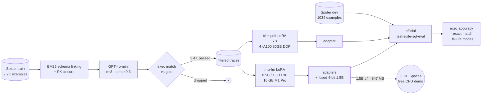

<h1 align="center">distill-sql</h1>

<p align="center">
  <a href="https://huggingface.co/spaces/zxuhan7/Distill-SQL"></a>
  <a href="https://github.com/zxuhan/distill-sql/actions"></a>
  
  
</p>

<p align="center">
  
  
  
  
  
</p>

<p align="center"><strong>Distilled GPT-4o-mini's text-to-SQL ability into Qwen2.5 students (0.5B → 7B). The 1.5B 4-bit student fits in <code>847 MB</code>, runs on-device in <code>~1.2s</code>, and reaches <code>62.5%</code> on Spider dev. The 7B student reaches <code>75.0%</code>, within 5.1 points of the closed teacher (<code>80.1%</code>) at <code>&lt;1%</code> of the per-query cost.</strong></p>

<p align="center">
  
</p>

<h3 align="center">→ <a href="https://huggingface.co/spaces/zxuhan7/Distill-SQL">huggingface.co/spaces/zxuhan7/Distill-SQL</a> ←<br/><sub>type a question, watch SQL appear · no signup, no API key, free CPU tier</sub></h3>

---

## TL;DR

| | what | number |
|---|---|---:|
| **deployment row** | quantized 1.5B fits on a phone, runs on M1 in ~1.2s/query | **847 MB · 62.5%** |
| **scaling axis (M1)** | 0.5B → 1.5B → 3B distilled, same recipe, monotonic gains | **60.0% → 69.2% → 72.6%** |
| **scaling axis (cloud)** | 7B with 4-GPU DDP on A100, same recipe, +2.4 pt | **75.0%** |
| **closed teacher** | GPT-4o-mini on Spider dev (same prompting protocol) | **80.1%** |
| **distillation cost** | 9.7K Spider train examples × 3 self-consistency samples | **$0.27 OpenAI spend** |

The hard / extra splits — where teacher capacity actually shows — close from 14.9 / 18.6 pt gaps at the M1-trained 3B to 7.4 / 6.0 pt gaps at the cloud-trained 7B. Easy and medium are within 3 pt of teacher already at the 3B.

## Why on-device, distilled

Production text-to-SQL is bottlenecked by three things:

1. **Latency** — every query is a network round-trip to a remote LLM
2. **Per-token cost** — at scale, $0.30 / 1K queries adds up fast
3. **Data governance** — the schema and the question both leak to a closed model

A small enough on-device model removes all three. The question this repo answers is *how small can you go before the SQL stops being useful*. The answer turns out to be **1.5B parameters at 4-bit quantization** — 847 MB, fits on every modern phone, runs without a network. The 3B variant pushes accuracy to 72.6%; the cloud-trained 7B to 75.0%.

This isn't a paper — it's a self-contained study of distillation at the small end of the scaling axis, using a closed teacher and an open student family, evaluated by the official Spider evaluator.

## Results

### Headline numbers

<!-- HEADLINE_NUMBERS_START -->

Live numbers from `reports/results.md`. Updated by `scripts/05_make_report.py`.

| model | n | exec | easy | medium | hard | extra | exact_match |
|---|---|---|---|---|---|---|---|
| base_qwen_0p5b | 1034 | 0.339 | 0.508 | 0.361 | 0.224 | 0.151 | 0.087 |
| distilled_ablation_direct | 1034 | 0.594 | 0.786 | 0.643 | 0.489 | 0.283 | 0.198 |
| distilled_primary | 1034 | 0.600 | 0.815 | 0.668 | 0.477 | 0.223 | 0.217 |
| distilled_1p5b_q4 | 1034 | 0.625 | 0.835 | 0.695 | 0.494 | 0.259 | 0.233 |
| distilled_1p5b | 1034 | 0.692 | 0.855 | 0.756 | 0.534 | 0.446 | 0.246 |
| distilled_3b | 1034 | 0.726 | 0.903 | 0.814 | 0.569 | 0.392 | 0.261 |
| distilled_7b | 1034 | 0.750 | 0.867 | 0.814 | 0.644 | 0.518 | 0.364 |
| gpt_4o_mini_reference | 1034 | 0.801 | 0.931 | 0.843 | 0.718 | 0.578 | 0.223 |

<!-- HEADLINE_NUMBERS_END -->

<p align="center">
  
</p>

### 1. The scaling axis is monotonic with diminishing returns

Same recipe (rank-16 LoRA on all linear projections, ~3.4K execution-validated traces, 1 epoch), varying parameter count. Five points across 14× param range:

```
0.5B → 1.5B    +9.2 pt   (60.0 → 69.2)   3.0× params
1.5B →  3B     +3.4 pt   (69.2 → 72.6)   2.0× params
 3B  →  7B     +2.4 pt   (72.6 → 75.0)   2.3× params
 7B  → teacher +5.1 pt   (75.0 → 80.1)   closed model
```

The 0.5B → 1.5B jump is dominated by *eliminating execution errors* (failure mode `execution`: 14% → 8%). The 1.5B → 3B jump is mostly about *picking the right join keys in hard cases* (`hard`: 53.4% → 56.9%). The 3B → 7B jump is *closing the teacher gap on extra-difficulty queries* (`extra`: 39.2% → 51.8%, a +12.6 pt absolute gain on the hardest split).

### 2. Quantization is almost free if you do it last

Fusing the 1.5B LoRA adapter into the bf16 base, then post-training-quantizing to 4-bit:

|  | size on disk | exec accuracy | warm latency | tokens/s |
|---|---:|---:|---:|---:|
| 1.5B bf16 | 2.9 GB | 69.2% | 1.59s | 14 |
| **1.5B 4-bit (fused)** | **847 MB** | **62.5%** | **1.16s** | **18** |
| change | **3.4× smaller** | **−6.7 pt** | **27% faster** | **+29%** |

The 4-bit 1.5B beats every 0.5B configuration we trained (the best 0.5B distilled is 60.0%) in less storage than the 0.5B *base*. The "runs on a phone" pitch is literally true.

### 3. Execution-validated self-consistency does most of the heavy lifting

The teacher (GPT-4o-mini) generates 3 samples per question at temperature 0.3. Each sample is executed against the example's SQLite database; only the one whose result set matches gold (as a multiset) is kept as a training trace. Without this filter, the trace dataset would contain the teacher's *attempts*, including ones that confidently reference columns the schema doesn't have.

The shape of failure-mode counts (out of 1034 dev examples) is the cleanest scaling story in the repo:

| failure mode | base 0.5B | distilled 0.5B | distilled 1.5B | distilled 3B | distilled 7B |
|---|---:|---:|---:|---:|---:|
| `ok` (correct) | 329 | 575 | 670 | 709 | 776 |
| `wrong-result` (parses + runs, wrong rows) | 283 | 308 | 281 | 266 | 213 |
| `execution` (SQLite error) | **404** | 144 | 83 | 56 | **44** |
| `parse` (sqlglot fails) | 1 | 3 | 0 | 2 | 1 |
| `empty` (no SQL produced) | 17 | 4 | 0 | 1 | 0 |

The model isn't merely "better" — it has *learned the schemas it sees in training* and stopped inventing column names. Execution errors fall by ~10× from base to 7B distilled.

## Cherry-picked examples

```sql
-- Q179 (easy, db=flight_2)
-- "What is the country of the airline JetBlue Airways?"
gold:    SELECT Country FROM AIRLINES WHERE Airline = "JetBlue Airways"
0.5B:    SELECT country FROM airlines WHERE abbreviation = 'JetBlue Airways'  -- wrong column
3B:      SELECT country FROM airlines WHERE airline = 'JetBlue Airways'        -- ok
```

```sql
-- Q270 (medium, db=employee_hire_evaluation)
-- "Find the manager name and district of the shop with the most products."
gold:    SELECT manager_name, district FROM shop ORDER BY number_products DESC LIMIT 1
0.5B:    SELECT s.name, s.district FROM shop AS s JOIN hiring AS h ...        -- joins it doesn't need
3B:      SELECT manager_name, district FROM shop
         WHERE number_products = (SELECT MAX(number_products) FROM shop)        -- ok (semantically equivalent)
```

```sql
-- Q24 (hard, db=concert_singer)
-- "Find names and capacities of stadiums that held concerts in 2014 or after."
gold:    SELECT T2.name, T2.capacity FROM concert AS T1 JOIN stadium AS T2
         ON T1.stadium_id = T2.stadium_id WHERE T1.year >= 2014
0.5B:    ... WHERE c.year = '2014' GROUP BY ...                               -- wrong operator + spurious GROUP BY
3B:      ... WHERE c.year >= '2014' GROUP BY ...                              -- ok
```

The 0.5B distilled student has the *vocabulary* (it knows `concert`, `stadium`, `manager_name`); what it lacks is enough capacity to get every operator and join key right under one prompt. Each step up the scaling axis trades raw size for failure-mode coverage.

## Architecture



The same trace JSONL feeds both the Mac arm and the cloud arm. Hyperparameters (rank, alpha, LR, schedule, dropout, target modules) are identical across all five training runs — only the parameter count and the framework differ. That's load-bearing for the scaling-axis claim.

Detailed module map: see [docs/methodology.md](docs/methodology.md). Cloud A100 walkthrough: [docs/cloud_a100.md](docs/cloud_a100.md). HF Space deploy walkthrough: [docs/hf_space.md](docs/hf_space.md).

## Latency and cost

Cold-load and warm-steady-state, sampled on a 16 GB M1 Pro at greedy decoding with ~464-token schema-linked prompts:

| model | warm wall-clock / query | tokens/s | cold load | model on disk | $ / 1K queries |
|---|---:|---:|---:|---:|---:|
| `base_qwen_0p5b` | 0.61s | 60 | 3.3s | 1.0 GB | electricity |
| `distilled_primary (0.5B)` | 0.65s | 31 | 1.9s | 1.0 GB | electricity |
| `distilled_1p5b_q4` | **1.16s** | 18 | **0.8s** | **847 MB** | electricity |
| `distilled_1p5b (bf16)` | 1.59s | 14 | 3.2s | 2.9 GB | electricity |
| `distilled_3b (4-bit base)` | 2.03s | 10 | 0.8s | 1.7 GB | electricity |
| `gpt_4o_mini_reference` | network RTT | n/a | n/a | n/a | $0.30 |

Local marginal cost is electricity-only (well under $0.0001/query). For context, GPT-4o-mini at the same prompt sizes runs ~$0.0003/query. At any nontrivial volume the local model is effectively free, plus zero network latency and zero data egress.

Full table: [reports/latency.md](reports/latency.md).

## Reproduce

The repo is `uv`-driven. Cross-platform deps install cleanly: `mlx` and `mlx-lm` are gated behind a `sys_platform == 'darwin'` marker, so a Linux/CUDA box will skip them and pull only the cloud-arm requirements.

```sh
git clone https://github.com/zxuhan/distill-sql
cd distill-sql
uv sync --all-extras                 # creates .venv with all deps + dev tools
```

Then, in order:

```sh
make data                            # fetch Spider from HF (~1 GB, 30s on a fast pipe)
cp .env.example .env                 # set OPENAI_API_KEY
make teacher                         # generate self-consistency traces (~$10, gated by RPD)
make train                           # primary 0.5B, ~50 min on M1
uv run python scripts/03_train_student.py --config configs/train_ablation.yaml
uv run python scripts/03_train_student.py --config configs/train_1p5b.yaml
uv run python scripts/03_train_student.py --config configs/train_3b.yaml

# fuse + 4-bit quantize the 1.5B for deployment (~5 min)
uv run python -m mlx_lm fuse \
    --model mlx-community/Qwen2.5-1.5B-Instruct-bf16 \
    --adapter-path artifacts/runs/scaling_1p5b/adapter \
    --save-path artifacts/runs/scaling_1p5b/fused
uv run python -m mlx_lm convert \
    --hf-path artifacts/runs/scaling_1p5b/fused \
    --mlx-path artifacts/runs/scaling_1p5b/fused_q4 -q

make eval                            # all local students + GPT-4o-mini reference (~80 min)
make report                          # rebuild reports/results.md + figures + README headline table
```

For the 7B cloud point, see [docs/cloud_a100.md](docs/cloud_a100.md). One-command launcher (`bash scripts/run_a100.sh`) auto-detects GPU count and dispatches DDP. Score the cloud predictions home-side via:

```sh
uv run python scripts/score_jsonl.py \
    --predictions reports/predictions/distilled_7b.jsonl \
    --name distilled_7b
```

**Reproduction barriers, in honesty:**

- The teacher generation step needs an OpenAI API key + ~$10 + a few hours (Tier-1 daily-request cap forces a multi-day run if you don't upgrade). Cached responses live under `artifacts/cache/teacher/` so re-runs are free.
- The 3B M1 run takes ~5 hours on a 16 GB M1 (4-bit base + LoRA + grad checkpoint + seq 1024 + grad_accum 4).
- The 7B run requires a CUDA GPU; an A100 80GB single-card session is enough, ~$5 of pod time.

If you only want the demo: skip everything and visit the [HF Space](https://huggingface.co/spaces/zxuhan7/Distill-SQL).

## Methodology highlights

Decisions worth knowing without reading the methodology doc:

- **Execution-validated self-consistency at the teacher.** n=3 samples × temperature 0.3, executed against the example's SQLite db, multiset-equality vs gold rows. Drops ~30% of teacher attempts; what remains is by-construction grounded in the schema.
- **Schema linking via BM25 + foreign-key closure** when the full schema would exceed ~1500 tokens. Matters for ~10% of Spider's larger schemas.
- **Two prompt modes** (60% direct / 40% reasoning at trace generation). Reasoning helps `easy` (+2.9 pt on the 0.5B mix vs direct-only) but hurts `extra` (−6.0 pt) — small students appear to waste budget on the reasoning prefix.
- **Final checkpoint, not val-loss-best.** Val loss is token-level CE on held-out *teacher traces*; it does not measure Spider exec accuracy. Picking val-best lost ~2.7 pt on both 0.5B configurations vs picking the last iteration.
- **MLX-native LoRA** (mlx-lm, rank 16, alpha 32, all decoder linears) on Mac. **trl + peft + bitsandbytes** with identical hyperparameters on CUDA. Predictions JSONL schema is identical so the scoring + report stages are framework-agnostic.

Full notes: [docs/methodology.md](docs/methodology.md).

## Limitations & roadmap

Honest gaps:

- **Spider is from 2018.** Modern text-to-SQL papers benchmark on [BIRD](https://bird-bench.github.io/) (2023) for harder, more realistic schemas. A BIRD-dev number for the 1.5B / 3B / 7B is the most-impactful next thing; ~1 hour of work, no GPU needed.
- **The 7B doesn't beat the closed teacher.** Best estimate: a 14B 4-bit student lands at 77-80%, possibly tying the teacher overall. Not run in this repo (compute budget). Code path is in `configs/train_14b_cuda.yaml` if you have an 80 GB A100 and ~4 hr.
- **No RL from execution feedback.** Standard recipe for closing the last gap to teacher: after SFT, treat the gold-vs-prediction execution-match boolean as a reward and run a few thousand PPO/GRPO updates. Probably worth +2-4 pt.
- **Single-DB execution match, not the full test-suite execution accuracy** of [Zhong et al. 2020](https://arxiv.org/abs/2010.02840). The vendored evaluator supports test-suite via `--etype all`; we report the slightly more lenient single-DB number.
- **Reasoning prefix at inference is off** — empirically it helps the teacher and hurts the small student. A larger student (14B+) might re-benefit from a reasoning prompt at inference.
- **Demo runs on CPU** at the free-tier Space. Latency is ~5-10s/query. Upgrade to a T4 ($0.40/hr) makes it ~2-3s but I'm leaving the demo on free for accessibility.

## References

- **Spider benchmark.** Yu, T. et al. (2018). [Spider: A Large-Scale Human-Labeled Dataset for Complex and Cross-Domain Semantic Parsing and Text-to-SQL Task](https://arxiv.org/abs/1809.08887). EMNLP.
- **BIRD benchmark.** Li, J. et al. (2023). [Can LLM Already Serve as a Database Interface? A BIg Bench for Large-Scale Database Grounded Text-to-SQLs](https://arxiv.org/abs/2305.03111). NeurIPS.
- **Test-suite execution accuracy.** Zhong, R. et al. (2020). [Semantic Evaluation for Text-to-SQL with Distilled Test Suites](https://arxiv.org/abs/2010.02840). EMNLP. — vendored at `third_party/test-suite-sql-eval/`.
- **Knowledge distillation.** Hinton, G. et al. (2015). [Distilling the Knowledge in a Neural Network](https://arxiv.org/abs/1503.02531).
- **LoRA.** Hu, E. et al. (2021). [LoRA: Low-Rank Adaptation of Large Language Models](https://arxiv.org/abs/2106.09685). ICLR.
- **Self-consistency.** Wang, X. et al. (2022). [Self-Consistency Improves Chain of Thought Reasoning in Language Models](https://arxiv.org/abs/2203.11171).
- **Apple MLX.** Hannun, A. et al. (2023). [MLX: An array framework for Apple silicon](https://github.com/ml-explore/mlx).
- **Qwen2.5 family.** Qwen Team (2024). [Qwen2.5 Technical Report](https://arxiv.org/abs/2412.15115).
- **GPT-4o-mini.** OpenAI (2024). Used as the teacher; pricing and prompting protocol per the [OpenAI API docs](https://platform.openai.com/docs/models/gpt-4o-mini).

## Citing Spider

```bibtex
@inproceedings{yu-etal-2018-spider,
  title     = "Spider: A Large-Scale Human-Labeled Dataset for Complex and
               Cross-Domain Semantic Parsing and Text-to-SQL Task",
  author    = "Yu, Tao and Zhang, Rui and Yang, Kai and Yasunaga, Michihiro and
               Wang, Dongxu and Li, Zifan and Ma, James and Li, Irene and
               Yao, Qingning and Roman, Shanelle and Zhang, Zilin and Radev,
               Dragomir",
  booktitle = "EMNLP",
  year      = "2018"
}
```

The official evaluator vendored at `third_party/test-suite-sql-eval/` is from <https://github.com/taoyds/test-suite-sql-eval>, Apache 2.0, license preserved alongside the source.
