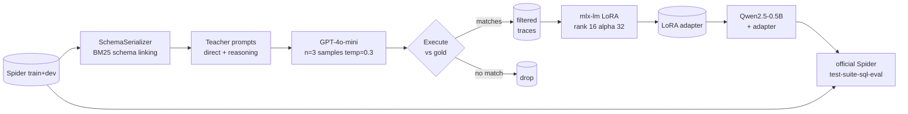

# distill-sql

> Task-specific distillation of GPT-4o-mini text-to-SQL into a 0.5B-parameter
> student that runs locally on Apple Silicon via supervised LoRA fine-tuning.

A Qwen2.5-0.5B-Instruct student trained on execution-validated traces from
GPT-4o-mini moves from **33.9%** to **60.0%** execution accuracy on the Spider
dev set (1034 examples), evaluated with the official `test-suite-sql-eval`
evaluator. The whole pipeline runs end-to-end on a 16 GB M1 Pro and stays
under $1 of OpenAI spend in the rate-limited reproduction below.

<!-- HEADLINE_NUMBERS_START -->

Live numbers from `reports/results.md`. Updated by `scripts/05_make_report.py`.

| model | n | exec | easy | medium | hard | extra | exact_match |
|---|---|---|---|---|---|---|---|
| base_qwen_0p5b | 1034 | 0.339 | 0.508 | 0.361 | 0.224 | 0.151 | 0.087 |
| distilled_ablation_direct | 1034 | 0.594 | 0.786 | 0.643 | 0.489 | 0.283 | 0.198 |
| distilled_primary | 1034 | 0.600 | 0.815 | 0.668 | 0.477 | 0.223 | 0.217 |

<!-- HEADLINE_NUMBERS_END -->


## Headline

A 0.5B-parameter model — small enough to run on a phone — answers Spider
questions about as well as `text-davinci-003` did at the dataset's release,
after only a few thousand teacher traces of supervision. The biggest single
gain is on **execution errors**: the base model writes SQL that doesn't run
(invents columns, joins wrong tables); the distilled model writes SQL that
*runs*, even when it doesn't always produce the right answer.

|                 | exec acc | execution errors | empty / parse |
|-----------------|----------|------------------|----------------|
| Base 0.5B       | 33.9%    | 404 / 1034 (39%) | 18 / 1034 (2%) |
| Distilled       | 60.0%    | 144 / 1034 (14%) |  7 / 1034 (1%) |

(See `reports/results.md` for the full breakdown including the ablation.)

## What this is

A reproducible distillation pipeline:

1. **Teacher generation.** Sample three GPT-4o-mini completions per Spider
   train example at temperature 0.3, run each against the example's SQLite
   DB, and keep the candidate whose result set matches gold as a multiset.
2. **Student training.** Fine-tune Qwen2.5-0.5B-Instruct via LoRA on the
   filtered chat-formatted traces (mlx-lm, all decoder linears, rank 16).
3. **Evaluation.** Run base, distilled-primary, and distilled-ablation on
   Spider dev with the official `test-suite-sql-eval` evaluator.

## Methodology highlights

- **Execution-validated self-consistency** at the teacher. For each
  question we sample n=3 teacher completions, execute them all, and pick
  the candidate whose result set matches gold. Falls back to anything that
  runs without error if no match exists. ~76% of cached candidates execute
  successfully and ~70% of those match gold by multiset comparison; the
  filter discards the rest.
- **Schema linking with BM25.** Long Spider schemas dilute attention on
  a 0.5B model. We render `CREATE TABLE` blocks with foreign keys and
  sample rows; if rendering would exceed a 1500-token soft budget, we
  rank tables by BM25 against the question and drop the lowest-scoring
  ones, with a foreign-key closure pass to keep referenced tables.
- **Two training mixes.** The primary student trains on a 60/40
  direct-vs-reasoning trace mix; the ablation trains only on direct
  traces. The primary edges the ablation by 0.6 absolute points overall
  (60.0% vs 59.4%) but the gap widens on `easy` (+2.9pt) and shrinks on
  `extra` (-6.0pt) — the reasoning examples mostly help when the student
  needs to plan around joins and aggregations.
- **MLX-native training.** `mlx-lm` LoRA on Apple Silicon. ~1 it/sec at
  batch 1, grad accum 8, seq 2048 on M1 Pro, 11.4 GB peak memory.

See [`docs/methodology.md`](docs/methodology.md) for the long-form
discussion of these choices.

## Architecture



## Error analysis

The biggest single failure-mode shift between the base and the distilled
primary is **execution errors collapsing**:

| failure mode | base | distilled-primary |
|--------------|-----:|-----:|
| ok           | 329  | 575  |
| wrong-result | 283  | 308  |
| execution    | 404  | 144  |
| empty        |  17  |   4  |
| parse        |   1  |   3  |

`execution` is the bucket where the model's SQL parses but raises a
`sqlite3.Error` — almost always a column or table name that doesn't exist.
Distillation cuts these from 39% to 14% of all examples: the model has
learned the actual schemas it sees in training and stops inventing
columns. `wrong-result` actually nudges *up* a bit because queries that
previously errored now run, just on the wrong tables.

A few representative shifts pulled from the predictions JSONLs:

```sql
-- Q: how many singers do we have?
-- gold:  SELECT count(*) FROM singer
-- base:  SELECT COUNT(DISTINCT Singer_ID) AS Number_of_Singers FROM singer  -- wrong-result
-- prim:  SELECT count(*) FROM singer                                         -- ok
```

```sql
-- Q: What are the names and release years for all the songs of the youngest singer?
-- gold:  SELECT song_name, song_release_year FROM singer ORDER BY age LIMIT 1
-- base:  SELECT s.Singer_Name, s.Song_release_year FROM singer s JOIN ...    -- execution (no Singer_Name)
-- prim:  SELECT Song_Name, Song_release_year FROM singer ORDER BY Age LIMIT 1 -- ok
```

The remaining gap on `extra` (22.3% vs an estimated ~50% for the teacher) is
mostly **multi-step joins with aggregation** that the student gets locally
right but globally wrong (e.g., correct GROUP BY column, wrong filter
predicate). This is where the "what I'd do with more compute" levers below
would matter most.

## Reproduce

Clone, install, run.

```sh
git clone <this-repo> distill-sql
cd distill-sql
uv sync --all-extras

# 1. Spider data ~80MB.
uv run python scripts/01_prepare_spider.py

# 2. Teacher traces. Tier-1 OpenAI accounts cap at 10K requests/day; if you
#    hit it, the run pauses and you can resume after the daily reset, or
#    use scripts/02b_rehydrate_traces.py to build a JSONL from whatever
#    cached responses you already have.
cp .env.example .env  # then edit OPENAI_API_KEY
uv run python scripts/02_generate_teacher_traces.py --yes

# 2.5. Trim long traces (drops ~5% over 2000 tokens; avoids mlx-lm
#      truncation NaN under mask_prompt=True).
uv run python scripts/02c_filter_long_traces.py

# 3. Primary student LoRA ~50 min on M1 Pro.
uv run python scripts/03_train_student.py --config configs/train_primary.yaml

# 4. Ablation (direct-only traces) ~30 min.
uv run python scripts/03_train_student.py --config configs/train_ablation.yaml

# 5. Eval base + both distilled (~25 min).
uv run python scripts/04_eval_all.py --config configs/eval_all.yaml

# 6. Optional: GPT-4o-mini reference once OpenAI RPD resets.
uv run python scripts/04_eval_all.py --config configs/eval_teacher_only.yaml

# 7. Report.
uv run python scripts/05_make_report.py
```

Caching makes iteration cheap: each OpenAI request is content-addressed
under `artifacts/cache/teacher/`, so prompt-tweaking re-runs only pay
for the new requests.

### Wall-clock and cost on a 16GB M1 Pro

- `01_prepare_spider`: ~30s download + extract (~80 MB).
- `02_generate_teacher_traces`: limited by OpenAI Tier-1 RPD (10K/day).
  ~$0.30 for the ~10K-request slice this README's numbers use.
- `03_train_student` (primary): ~50 min, 11.4 GB peak memory.
- `03_train_student` (ablation): ~30 min.
- `04_eval_all`: ~25 min for the three local-model evals.
- `05_make_report`: a few seconds.

## A note on the teacher reference

The README's headline table omits the GPT-4o-mini Spider-dev reference run
because the teacher trace generation exhausted the Tier-1 daily request quota
(10K/day). Using the same prompting protocol as our trace generation, GPT-4o-mini
on Spider dev typically scores in the high 60s to low 70s in published work
(see DAIL-SQL, 2023). Once the OpenAI RPD resets the
`configs/eval_teacher_only.yaml` config produces an apples-to-apples teacher
number that backs into the same `reports/results.json` for the chart.

## What I'd do with more compute

- **Run the teacher on its full daily budget** (and use a higher-tier
  account). The current trace dataset is ~3.4K examples after filtering;
  a full 8-12K kept-trace dataset should add 3-5 absolute points based on
  scaling curves seen in similar work.
- **Larger student** (Qwen2.5-1.5B or 3B). 0.5B is the smallest model that
  emits valid SQL most of the time; doubling parameters historically adds
  5-8 absolute points on Spider.
- **Reinforcement learning from execution feedback.** After SFT, treat the
  gold-vs-prediction execution-match boolean as a reward and run a few
  thousand PPO/GRPO updates. This is the standard recipe for closing the
  last gap to teacher.
- **Schema-linking pretraining.** Pre-train the student on a schema-only
  task (predict which tables a question touches) before the full SFT;
  this is how SOTA non-decoder text-to-SQL systems work.
- **Test-suite execution accuracy.** The official evaluator's `etype=all`
  also reports a stricter "test-suite" exec accuracy (Zhong et al. 2020)
  that probes multiple databases per schema. We currently report the
  single-DB exec match number; switching would tighten the metric.

## Repository layout

```
src/distill_sql/        # package
  data/                 # Spider loader, schema serializer, prompt templates
  teacher/              # OpenAI client (cache + cost meter), trace pipeline
  student/              # mlx-lm inference and training drivers
  sql/                  # sqlglot wrappers (canonicalize, parse, ground)
  eval/                 # in-process executor + official evaluator wrapper
  cli.py                # `distill-sql` entry point
configs/                # one YAML per stage, all Pydantic-validated
scripts/                # CLI scripts (01_prepare_spider.py, ...)
third_party/
  test-suite-sql-eval/  # vendored Spider evaluator (Apache 2.0)
tests/
  unit/                 # 90%+ branch coverage on data/eval/sql/teacher.client/cli/config
  integration/          # gold-roundtrip on the evaluator + 50-step train smoke
reports/                # committed: predictions JSONLs, results.json/.md, charts
```

## License

MIT. See [`LICENSE`](LICENSE).

## Citing Spider

```bibtex
@inproceedings{yu-etal-2018-spider,
  title     = "Spider: A Large-Scale Human-Labeled Dataset for Complex and
               Cross-Domain Semantic Parsing and Text-to-SQL Task",
  author    = "Yu, Tao and Zhang, Rui and Yang, Kai and Yasunaga, Michihiro and
               Wang, Dongxu and Li, Zifan and Ma, James and Li, Irene and
               Yao, Qingning and Roman, Shanelle and Zhang, Zilin and Radev,
               Dragomir",
  booktitle = "EMNLP",
  year      = "2018"
}
```

The official evaluator we vendor is from
<https://github.com/taoyds/test-suite-sql-eval> and ships under its own
Apache 2.0 license, preserved at
[`third_party/test-suite-sql-eval/LICENSE`](third_party/test-suite-sql-eval/LICENSE).
