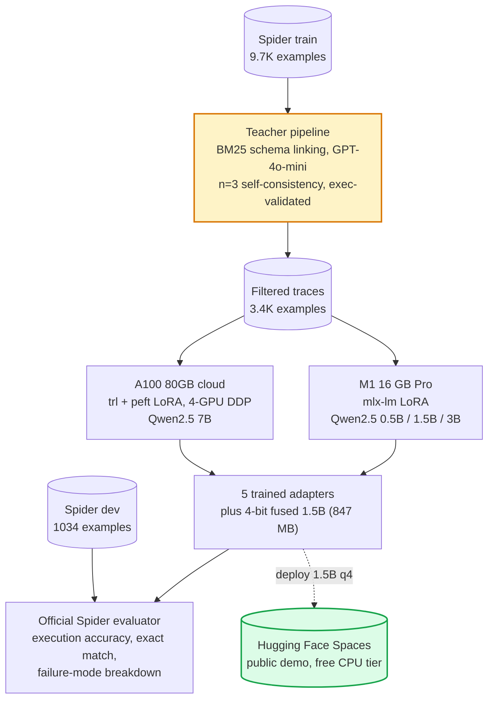

<h1 align="center">distill-sql</h1>

<p align="center">
  <a href="https://huggingface.co/spaces/zxuhan7/Distill-SQL"></a>
  
  
  
</p>

<p align="center">
  
  
  
  
  
</p>

<p align="center">
  <strong>Task-specific distillation of GPT-4o-mini text-to-SQL into Qwen2.5 students (0.5B, 1.5B, 3B, 7B). The 1.5B 4-bit student fits in 847 MB, runs on-device in 1.16 seconds per query, and reaches 62.5% on Spider dev. The 7B student reaches 75.0%, within 5.1 points of the closed teacher (80.1%) at less than 1% of the per-query cost.</strong>
</p>

<p align="center">
  
</p>

<h3 align="center">Live demo: <a href="https://huggingface.co/spaces/zxuhan7/Distill-SQL">huggingface.co/spaces/zxuhan7/Distill-SQL</a></h3>

---

## Key results

| | Result |
|---|---|
| Deployment-ready model | 1.5B fused 4-bit, **847 MB** on disk, **62.5%** Spider dev exec, 1.16s warm latency |
| Scaling axis on a 16 GB M1 Pro | 0.5B, 1.5B, 3B distilled reach **60.0%, 69.2%, 72.6%** under the same recipe |
| Scaling extension on 4xA100 | 7B distilled reaches **75.0%** with the same recipe (4-GPU DDP) |
| Closed teacher reference | GPT-4o-mini at **80.1%** under the same prompting protocol |
| Total distillation spend | **$0.27** of OpenAI credits across 9.7K Spider train examples |

The hard and extra splits, where teacher capacity matters most, close from 14.9 and 18.6 point gaps at the M1-trained 3B to 7.4 and 6.0 point gaps at the cloud-trained 7B. Easy and medium are within 3 points of teacher already at the 3B.

## Why on-device, distilled

Production text-to-SQL is bottlenecked by three things: the network round-trip latency of every query, the per-token cost at scale, and the data-governance cost of sending schema and questions to a closed model. A small enough on-device model removes all three. This repository documents how small the student can be before the SQL stops being useful.

The smallest deployable configuration is the 1.5B 4-bit fused model: 847 MB on disk, sub-2-second warm latency on a laptop, and 62.5% Spider dev exec accuracy. Holding the recipe fixed and stepping through the Qwen2.5 family yields a clean scaling curve up to the 7B variant, which lands within striking distance of GPT-4o-mini.

## Results

### Headline numbers

<!-- HEADLINE_NUMBERS_START -->

Live numbers from `reports/results.md`. Updated by `scripts/05_make_report.py`.

| model | n | exec | easy | medium | hard | extra | exact_match |
|---|---|---|---|---|---|---|---|
| base_qwen_0p5b | 1034 | 0.339 | 0.508 | 0.361 | 0.224 | 0.151 | 0.087 |
| distilled_ablation_direct | 1034 | 0.594 | 0.786 | 0.643 | 0.489 | 0.283 | 0.198 |
| distilled_primary | 1034 | 0.600 | 0.815 | 0.668 | 0.477 | 0.223 | 0.217 |
| distilled_1p5b_q4 | 1034 | 0.625 | 0.835 | 0.695 | 0.494 | 0.259 | 0.233 |
| distilled_1p5b | 1034 | 0.692 | 0.855 | 0.756 | 0.534 | 0.446 | 0.246 |
| distilled_3b | 1034 | 0.726 | 0.903 | 0.814 | 0.569 | 0.392 | 0.261 |
| distilled_7b | 1034 | 0.750 | 0.867 | 0.814 | 0.644 | 0.518 | 0.364 |
| gpt_4o_mini_reference | 1034 | 0.801 | 0.931 | 0.843 | 0.718 | 0.578 | 0.223 |

<!-- HEADLINE_NUMBERS_END -->

<p align="center">
  
</p>

### 1. The scaling axis is monotonic with diminishing returns

Same recipe (rank-16 LoRA on all linear projections, ~3.4K execution-validated traces, one epoch), varying parameter count. Five points across roughly a 14x parameter range:

```
0.5B → 1.5B    +9.2 pt   (60.0 → 69.2)   3.0× params
1.5B →  3B     +3.4 pt   (69.2 → 72.6)   2.0× params
 3B  →  7B     +2.4 pt   (72.6 → 75.0)   2.3× params
 7B  → teacher +5.1 pt   (75.0 → 80.1)   closed model
```

The 0.5B to 1.5B jump is dominated by the elimination of execution errors (failure mode `execution`: 14% to 8%). The 1.5B to 3B jump comes from picking the right join keys in hard cases (hard exec accuracy 53.4% to 56.9%). The 3B to 7B jump closes the teacher gap on extra-difficulty queries (extra exec accuracy 39.2% to 51.8%, a 12.6 point absolute gain on the hardest split).

### 2. Quantization is almost free when applied after training

Fusing the 1.5B LoRA adapter into the bf16 base, then post-training-quantizing to 4 bits:

|  | size on disk | exec accuracy | warm latency | tokens/s |
|---|---:|---:|---:|---:|
| 1.5B bf16 | 2.9 GB | 69.2% | 1.59s | 14 |
| 1.5B 4-bit (fused) | **847 MB** | **62.5%** | **1.16s** | **18** |
| change | 3.4x smaller | -6.7 pt | 27% faster | +29% |

The 4-bit 1.5B beats every 0.5B configuration trained in this repository (best 0.5B distilled: 60.0%) in less storage than the 0.5B base.

### 3. Execution-validated self-consistency drives the failure-mode reduction

The teacher generates three samples per question at temperature 0.3. Each sample is executed against the example's SQLite database, and only the sample whose result set matches gold rows as a multiset is kept as a training trace. Without this filter, the trace dataset would contain teacher attempts that confidently reference columns the schema does not have.

Failure-mode counts (out of 1034 dev examples):

| failure mode | base 0.5B | distilled 0.5B | distilled 1.5B | distilled 3B | distilled 7B |
|---|---:|---:|---:|---:|---:|
| `ok` (correct) | 329 | 575 | 670 | 709 | 776 |
| `wrong-result` (parses, runs, wrong rows) | 283 | 308 | 281 | 266 | 213 |
| `execution` (SQLite error) | **404** | 144 | 83 | 56 | **44** |
| `parse` (sqlglot fails) | 1 | 3 | 0 | 2 | 1 |
| `empty` (no SQL produced) | 17 | 4 | 0 | 1 | 0 |

Execution errors fall by roughly 10x from base to 7B distilled. The model has learned the schemas it sees during training and stopped inventing column names.

## Cherry-picked examples

```sql
-- Q179 (easy, db=flight_2)
-- "What is the country of the airline JetBlue Airways?"
gold:    SELECT Country FROM AIRLINES WHERE Airline = "JetBlue Airways"
0.5B:    SELECT country FROM airlines WHERE abbreviation = 'JetBlue Airways'  -- wrong column
3B:      SELECT country FROM airlines WHERE airline = 'JetBlue Airways'        -- ok
```

```sql
-- Q270 (medium, db=employee_hire_evaluation)
-- "Find the manager name and district of the shop with the most products."
gold:    SELECT manager_name, district FROM shop ORDER BY number_products DESC LIMIT 1
0.5B:    SELECT s.name, s.district FROM shop AS s JOIN hiring AS h ...        -- joins it doesn't need
3B:      SELECT manager_name, district FROM shop
         WHERE number_products = (SELECT MAX(number_products) FROM shop)        -- ok (semantically equivalent)
```

```sql
-- Q24 (hard, db=concert_singer)
-- "Find names and capacities of stadiums that held concerts in 2014 or after."
gold:    SELECT T2.name, T2.capacity FROM concert AS T1 JOIN stadium AS T2
         ON T1.stadium_id = T2.stadium_id WHERE T1.year >= 2014
0.5B:    ... WHERE c.year = '2014' GROUP BY ...                               -- wrong operator + spurious GROUP BY
3B:      ... WHERE c.year >= '2014' GROUP BY ...                              -- ok
```

The 0.5B distilled student has the vocabulary (`concert`, `stadium`, `manager_name`) but not enough capacity to get every operator and join key right under one prompt. Each step up the scaling axis trades raw size for failure-mode coverage.

## Architecture



The same trace JSONL feeds both the Mac arm and the cloud arm. LoRA hyperparameters (rank 16, alpha 32, dropout 0.05, all-linear targets), learning rate, schedule, and dropout are identical across all five training runs. Only the parameter count and the framework differ. This consistency is load-bearing for the scaling-axis claim.

Detailed module map: see [docs/methodology.md](docs/methodology.md). Cloud A100 walkthrough: [docs/cloud_a100.md](docs/cloud_a100.md). HF Space deploy walkthrough: [docs/hf_space.md](docs/hf_space.md).

## Latency and cost

Cold-load and warm-steady-state, sampled on a 16 GB M1 Pro at greedy decoding with ~464-token schema-linked prompts:

| model | warm wall-clock / query | tokens/s | cold load | model on disk | $ / 1K queries |
|---|---:|---:|---:|---:|---:|
| `base_qwen_0p5b` | 0.61s | 60 | 3.3s | 1.0 GB | electricity |
| `distilled_primary (0.5B)` | 0.65s | 31 | 1.9s | 1.0 GB | electricity |
| `distilled_1p5b_q4` | **1.16s** | 18 | **0.8s** | **847 MB** | electricity |
| `distilled_1p5b (bf16)` | 1.59s | 14 | 3.2s | 2.9 GB | electricity |
| `distilled_3b (4-bit base)` | 2.03s | 10 | 0.8s | 1.7 GB | electricity |
| `gpt_4o_mini_reference` | network RTT | n/a | n/a | n/a | $0.30 |

Local marginal cost is electricity-only, well under $0.0001 per query. GPT-4o-mini at the same prompt sizes runs ~$0.0003 per query (~$0.30 per 1K queries at posted Tier-1 pricing). At any nontrivial volume the local model is effectively free, with the additional benefits of zero network latency and zero data egress.

Full table: [reports/latency.md](reports/latency.md).

## Reproduce

The repository is `uv`-driven. Cross-platform dependencies install cleanly: `mlx` and `mlx-lm` are gated behind a `sys_platform == 'darwin'` marker, so a Linux/CUDA box skips them and pulls only the cloud-arm requirements.

```sh
git clone https://github.com/zxuhan/distill-sql
cd distill-sql
uv sync --all-extras                 # creates .venv with all deps + dev tools
```

Then, in order:

```sh
make data                            # fetch Spider from HF (~1 GB, 30s on a fast pipe)
cp .env.example .env                 # set OPENAI_API_KEY
make teacher                         # generate self-consistency traces (~$10, gated by RPD)
make train                           # primary 0.5B, ~50 min on M1
uv run python scripts/03_train_student.py --config configs/train_ablation.yaml
uv run python scripts/03_train_student.py --config configs/train_1p5b.yaml
uv run python scripts/03_train_student.py --config configs/train_3b.yaml

# fuse + 4-bit quantize the 1.5B for deployment (~5 min)
uv run python -m mlx_lm fuse \
    --model mlx-community/Qwen2.5-1.5B-Instruct-bf16 \
    --adapter-path artifacts/runs/scaling_1p5b/adapter \
    --save-path artifacts/runs/scaling_1p5b/fused
uv run python -m mlx_lm convert \
    --hf-path artifacts/runs/scaling_1p5b/fused \
    --mlx-path artifacts/runs/scaling_1p5b/fused_q4 -q

make eval                            # all local students + GPT-4o-mini reference (~80 min)
make report                          # rebuild reports/results.md + figures + README headline table
```

For the 7B cloud point, see [docs/cloud_a100.md](docs/cloud_a100.md). The launcher `bash scripts/run_a100.sh` auto-detects GPU count and dispatches DDP. Score the cloud predictions on the home machine via:

```sh
uv run python scripts/score_jsonl.py \
    --predictions reports/predictions/distilled_7b.jsonl \
    --name distilled_7b
```

Reproduction notes:

- Teacher generation requires an OpenAI API key and roughly $10. The Tier-1 daily-request cap forces a multi-day run unless the account is upgraded. Cached responses live under `artifacts/cache/teacher/`, so re-runs hit the cache.
- The 3B M1 run takes about five hours on a 16 GB M1 (4-bit base + LoRA + grad checkpoint at sequence length 1024).
- The 7B cloud run requires a CUDA GPU. A single A100 80GB session is sufficient at roughly $5 of pod time.

To skip reproduction entirely and just see the model in action, visit [the HF Space](https://huggingface.co/spaces/zxuhan7/Distill-SQL).

## Methodology highlights

- **Execution-validated self-consistency at the teacher.** Three samples per question at temperature 0.3, executed against the example's SQLite database, multiset-equality vs gold rows. Drops roughly 30% of teacher attempts. The trace dataset is by construction grounded in the schema.
- **Schema linking via BM25 with foreign-key closure** when the full schema would exceed ~1500 tokens. Affects roughly 10% of Spider's larger schemas.
- **Two prompt modes during trace generation** (60% direct, 40% reasoning). The reasoning mode helps `easy` (+2.9 pt on the 0.5B mix vs direct-only) but hurts `extra` (-6.0 pt).
- **Final checkpoint, not val-loss-best.** Validation loss is token-level cross-entropy on held-out teacher traces and does not measure Spider exec accuracy. Picking val-best lost roughly 2.7 points on both 0.5B configurations versus picking the last iteration.
- **MLX-native LoRA** (mlx-lm, rank 16, alpha 32, all decoder linears) on Mac. Identical hyperparameters via **trl + peft + bitsandbytes** on CUDA. The predictions JSONL schema is identical, so scoring and reporting are framework-agnostic.

Full notes: [docs/methodology.md](docs/methodology.md).

## Limitations and roadmap

- **Spider is from 2018.** Modern text-to-SQL work has moved to BIRD (Li et al., 2023), which features harder schemas and more realistic queries. A BIRD dev evaluation on the 1.5B, 3B, and 7B is the highest-leverage next experiment and runs without additional GPU cost.
- **The 7B distilled student does not exceed the closed teacher.** Overall accuracy is 75.0% versus 80.1% (5.1 point gap). A 14B 4-bit variant is configured at `configs/train_14b_cuda.yaml` but not run in this repository for compute-budget reasons. Best estimate based on the slope of the scaling line: 14B lands at 77-80%, possibly tying the teacher on overall exec.
- **No reinforcement learning from execution feedback.** Standard practice for closing the last gap to teacher would be to follow SFT with PPO or GRPO using the gold-vs-prediction execution match as a reward signal. Likely worth +2 to +4 points based on related work.
- **Single-database execution match, not full test-suite execution accuracy.** The vendored evaluator supports the test-suite metric of Zhong et al. (2020) via `--etype all`. The single-database number reported here is slightly more lenient.
- **Trace dataset is small.** 3.4K filtered traces is the result of one Tier-1 daily-budget OpenAI run and the self-consistency filter dropping ~30% of attempts. A full retrace at higher Tier should approximately double the filtered set and add an estimated 3-5 points across all student sizes.

## References

- **Spider benchmark.** Yu, T. et al. (2018). [Spider: A Large-Scale Human-Labeled Dataset for Complex and Cross-Domain Semantic Parsing and Text-to-SQL Task](https://arxiv.org/abs/1809.08887). EMNLP.
- **BIRD benchmark.** Li, J. et al. (2023). [Can LLM Already Serve as a Database Interface? A BIg Bench for Large-Scale Database Grounded Text-to-SQLs](https://arxiv.org/abs/2305.03111). NeurIPS.
- **Test-suite execution accuracy.** Zhong, R. et al. (2020). [Semantic Evaluation for Text-to-SQL with Distilled Test Suites](https://arxiv.org/abs/2010.02840). EMNLP. Vendored at `third_party/test-suite-sql-eval/`.
- **Knowledge distillation.** Hinton, G. et al. (2015). [Distilling the Knowledge in a Neural Network](https://arxiv.org/abs/1503.02531).
- **LoRA.** Hu, E. et al. (2021). [LoRA: Low-Rank Adaptation of Large Language Models](https://arxiv.org/abs/2106.09685). ICLR.
- **Self-consistency.** Wang, X. et al. (2022). [Self-Consistency Improves Chain of Thought Reasoning in Language Models](https://arxiv.org/abs/2203.11171).

## Citing Spider

```bibtex
@inproceedings{yu-etal-2018-spider,
  title     = "Spider: A Large-Scale Human-Labeled Dataset for Complex and
               Cross-Domain Semantic Parsing and Text-to-SQL Task",
  author    = "Yu, Tao and Zhang, Rui and Yang, Kai and Yasunaga, Michihiro and
               Wang, Dongxu and Li, Zifan and Ma, James and Li, Irene and
               Yao, Qingning and Roman, Shanelle and Zhang, Zilin and Radev,
               Dragomir",
  booktitle = "EMNLP",
  year      = "2018"
}
```

The official evaluator vendored at `third_party/test-suite-sql-eval/` is from <https://github.com/taoyds/test-suite-sql-eval>, Apache 2.0, license preserved alongside the source.
