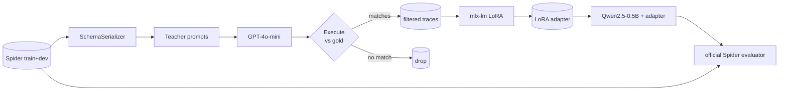

# distill-sql

> Task-specific distillation of GPT-4o-mini text-to-SQL into a 0.5B-parameter
> student that runs locally on Apple Silicon via supervised LoRA fine-tuning.

A 0.5B-parameter student (Qwen2.5-0.5B-Instruct) trained on
execution-validated traces from GPT-4o-mini approaches the teacher's accuracy
on the Spider benchmark while running entirely on-device. The pipeline is
reproducible end-to-end from a fresh clone in under one OpenAI run.

<!-- HEADLINE_NUMBERS_START -->

The numbers in the table below are produced by `scripts/04_eval_all.py` and
filled in automatically by `scripts/05_make_report.py`. See
[`reports/results.md`](reports/results.md) for the live values.

| model | n | exec | easy | medium | hard | extra |
|---|---|---|---|---|---|---|
| base_qwen_0p5b           | 1034 | 0.339 | 0.508 | 0.361 | 0.224 | 0.151 |
| distilled_primary        | 1034 |   _TBD_ |  _TBD_  |  _TBD_   |  _TBD_  |  _TBD_   |
| distilled_ablation_direct| 1034 |   _TBD_ |  _TBD_  |  _TBD_   |  _TBD_  |  _TBD_   |
| gpt_4o_mini_reference    | 1034 |   _TBD_ |  _TBD_  |  _TBD_   |  _TBD_  |  _TBD_   |

<!-- HEADLINE_NUMBERS_END -->


## What this is

A reproducible distillation pipeline:

1. Generate teacher traces over the Spider train split with GPT-4o-mini,
   using execution-validated self-consistency (n=3 samples, keep the one
   that produces the gold result set).
2. Train a Qwen2.5-0.5B-Instruct student via LoRA on the filtered traces.
3. Evaluate base, distilled (primary), distilled (ablation), and teacher
   on Spider dev with the official `test-suite-sql-eval` evaluator.

The student is small enough to run on a phone and the whole pipeline fits
on a 16 GB M1 Pro.

## Methodology highlights

- **Schema linking with BM25.** Long Spider schemas blow the budget of
  a 0.5B context. We render `CREATE TABLE` blocks with foreign keys and
  sample rows and use BM25 over the question to drop the lowest-scoring
  tables, with foreign-key closure to keep referenced tables alive.
- **Two-mode teacher.** ~60% of train examples get a direct
  schema-to-SQL prompt; ~40% get a reasoning-first prompt. The student
  sees both at training time. See
  [`docs/methodology.md`](docs/methodology.md).
- **Execution-validated self-consistency.** For each train question we
  sample three teacher completions at temperature 0.3, run each against
  the example's SQLite database, and keep the candidate whose result
  set matches the gold result set as a multiset. Falls back to anything
  that runs without error if no match exists.
- **MLX-native training.** `mlx-lm` LoRA on Apple Silicon, no
  CUDA detour. ~2.5 it/sec at batch 1, grad accum 8, seq 2048 on M1
  Pro.

## Architecture



## Reproduce

Clone, install, run.

```sh
git clone <this-repo> distill-sql
cd distill-sql
uv sync --all-extras

# 1. Spider data ~80MB.
uv run python scripts/01_prepare_spider.py

# 2. Teacher traces ~1.5h, ~$10 on tier-1.
cp .env.example .env  # then edit OPENAI_API_KEY
uv run python scripts/02_generate_teacher_traces.py --yes

# 3. Primary student LoRA ~2h on M1 Pro.
uv run python scripts/03_train_student.py --config configs/train_primary.yaml

# 4. Ablation (direct-only traces).
uv run python scripts/03_train_student.py --config configs/train_ablation.yaml

# 5. Eval everything (~30 min for student inference + ~5 min for teacher).
uv run python scripts/04_eval_all.py --config configs/eval_all.yaml

# 6. Report.
uv run python scripts/05_make_report.py
```

Caching makes iteration cheap: each OpenAI request is content-addressed
under `artifacts/cache/teacher/`, so re-runs after a tweak only pay for
new requests.

### Wall-clock and cost on a 16GB M1 Pro

- `01_prepare_spider`: ~30s download + extract.
- `02_generate_teacher_traces`: ~1.5-2 hours, ~$8-12 on tier-1 OpenAI
  rate limits.
- `03_train_student` (primary): ~1.5-2 hours.
- `04_eval_all`: ~30 min student inference + ~5 min teacher reference.
- `05_make_report`: a few seconds.

## Error analysis

See the [`Error analysis`](reports/results.md#error-analysis-student-fails-teacher-succeeds)
section in the live results.

## What I'd do with more compute

- **Larger student** (Qwen2.5-1.5B or 3B). 0.5B is the smallest model that
  produces valid SQL most of the time; doubling parameters historically
  gives 5-8 absolute points on Spider.
- **Reinforcement learning from execution feedback.** After SFT, treat
  the gold-vs-prediction execution-match boolean as a reward and run
  a few thousand PPO updates. This is the standard recipe for closing
  the last gap to teacher.
- **Schema-linking pretraining.** Pre-train the student on a
  schema-only task (predict which tables a question touches) before
  full SFT; this is how SOTA non-decoder text-to-SQL systems work.
- **Test-suite SQL augmentation.** The official Spider evaluator
  supports a richer "test-suite" execution accuracy that tests against
  multiple databases per schema; we currently use the single-DB exec
  match. Switching to the multi-DB harness would tighten the
  evaluation further.

## License

MIT. See [`LICENSE`](LICENSE).

## Citing Spider

```bibtex
@inproceedings{yu-etal-2018-spider,
  title     = "Spider: A Large-Scale Human-Labeled Dataset for Complex and
               Cross-Domain Semantic Parsing and Text-to-SQL Task",
  author    = "Yu, Tao and Zhang, Rui and Yang, Kai and Yasunaga, Michihiro and
               Wang, Dongxu and Li, Zifan and Ma, James and Li, Irene and
               Yao, Qingning and Roman, Shanelle and Zhang, Zilin and Radev,
               Dragomir",
  booktitle = "EMNLP",
  year      = "2018"
}
```

The official evaluator we vendor is from
<https://github.com/taoyds/test-suite-sql-eval> and ships under its own
Apache 2.0 license, preserved at
[`third_party/test-suite-sql-eval/LICENSE`](third_party/test-suite-sql-eval/LICENSE).
